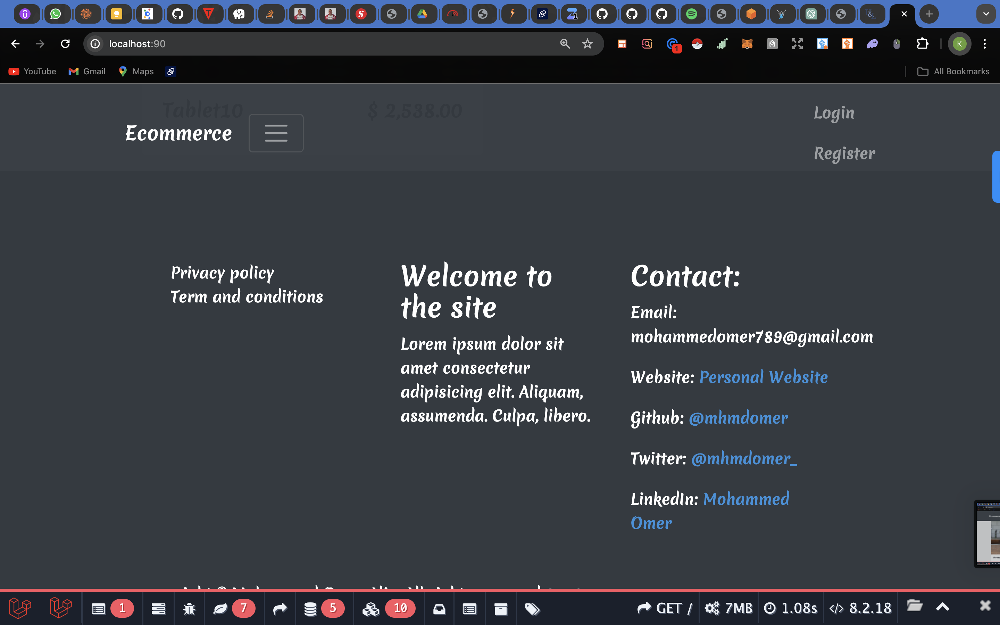
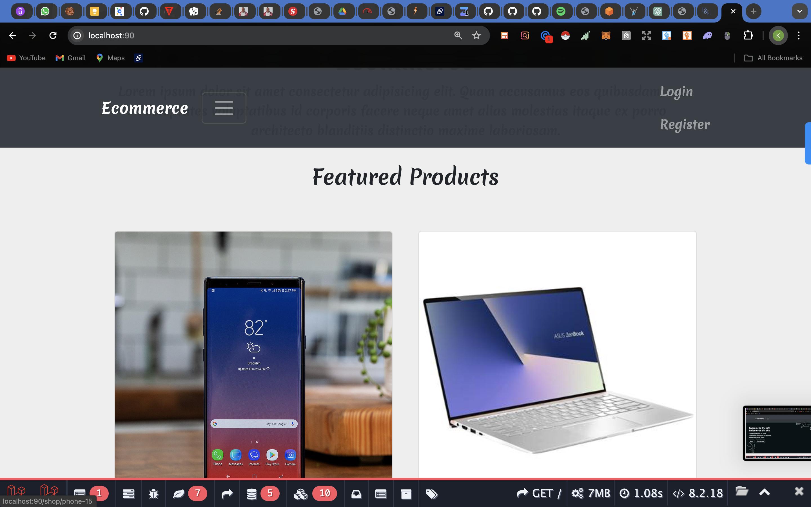
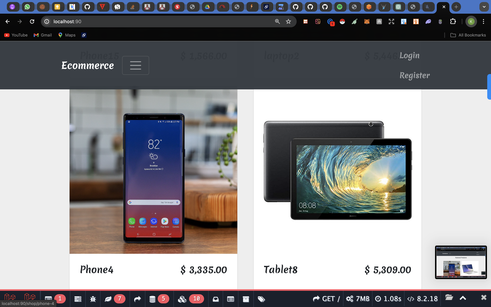

# Ecommerce Application Hosting (DevOps)

## Installation Guide

1. clone this repo to your local machine: `git clone https://github.com/healerkay/buy_sell_ecommerce.git && cd buy_and_sell`
1. copy `.example.env` to `.env` file: `cp .example.env .env`
1. create a new database and add the database credentials to your `.env` file
1. run `composer install`
1. run `npm install && npm run dev`
1. run `php artisan key:generate`
1. run `php artisan sail:install`
1. credentials to access admin panel (email: `admin@admin.com`, password: `password`)
1. after you login as admin, you can access the admin page from `http://127.0.0.1:8000/admin`
-   __Home Page__

-   __Shopping Page__

-  __Cart Page__

